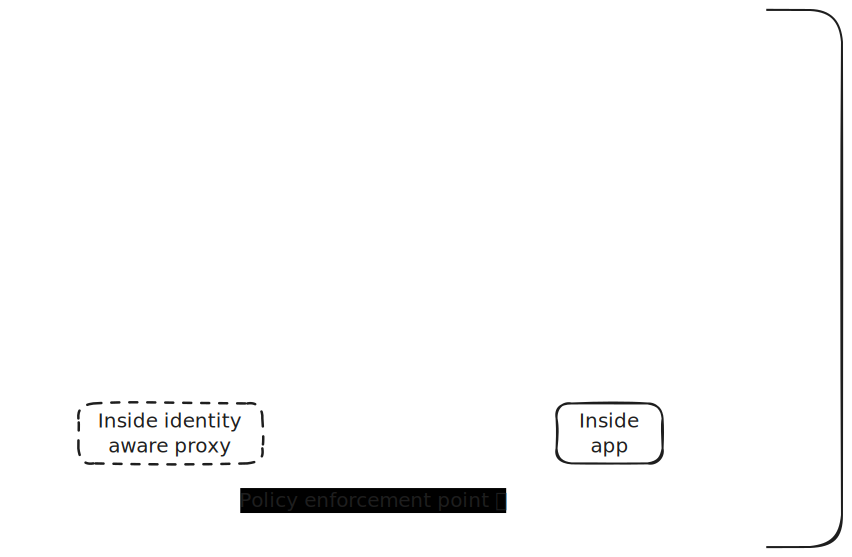

# Architecture



## Setup

Begin by installing [uv](https://docs.astral.sh/uv/getting-started/installation/), then simply run `uv sync` in the project folder.

## HTTP JSON API - Simple secrets manager

- Persist state using `shelve`
- Use `contextlib.asynccontextmanager` to manage the lifespan of the application
- Paths include:
  - `GET` `/me`
  - `GET` `/projects/{project_id}/secrets`
  - `POST` `/projects/{project_id}/secret`
- Use OpenFGA as policy decision point
- Use App as policy enforcement point

# Try it out

First, review the [the OpenFGA store](store.fga.yaml). Then proceed with spinning up the stack:

In Terminal 1:

```bash
docker compose up # spins up and initializes OpenFGA
```

In Terminal 2:

```bash
export FGA_STORE_ID=$(fga store list | jq -r '.stores | sort_by(.created_at) | last | .id') # get the store id
echo $FGA_STORE_ID # print store id
echo OPENFGA_STORE_ID=$FGA_STORE_ID > .env # write .env file
rm app.db # reset database
# Start the app
uv run uvicorn main:app --reload
```

Now you can start using the application. Review authorization offloading [in code](main.py) (lines `59` and `79`).

In Terminal 3:

```bash
# Check authentication (nobody vs alice)
curl -s localhost:8000/me | jq
curl -sH 'user: alice' localhost:8000/me | jq

# Create a secret in project 1 (alice)
curl -sX POST localhost:8000/projects/1/secret \
  -H 'user: alice' \
  -H 'Content-Type: application/json' \
  -d '{"name": "secret-ingredient", "value": "coffee"}'

# Create a secret in project 2 (bob)
curl -sX POST localhost:8000/projects/2/secret \
  -H 'user: bob' \
  -H 'Content-Type: application/json' \
  -d '{"name": "secret-ingredient", "value": "tea"}'

# List secrets in project 1 (alice)
curl -sH 'user: alice' localhost:8000/projects/1/secrets | jq

# List secrets in project 2 (alice)
curl -sH 'user: alice' localhost:8000/projects/2/secrets | jq

# Create secret in project 2 (alice)
curl -sX POST localhost:8000/projects/2/secret \
  -H 'user: alice' \
  -H 'Content-Type: application/json' \
  -d '{"name": "secret-ingredient", "value": "coffee"}'

# List secrets in project 1 (bob)
curl -sH 'user: bob' localhost:8000/projects/1/secrets | jq

# List secrets in project 2 (bob)
curl -sH 'user: bob' localhost:8000/projects/2/secrets | jq
```

# Think about applied IAM paradigms

- What have we gained by offloading authorization?
- What are the costs?
- Where to go from here?
